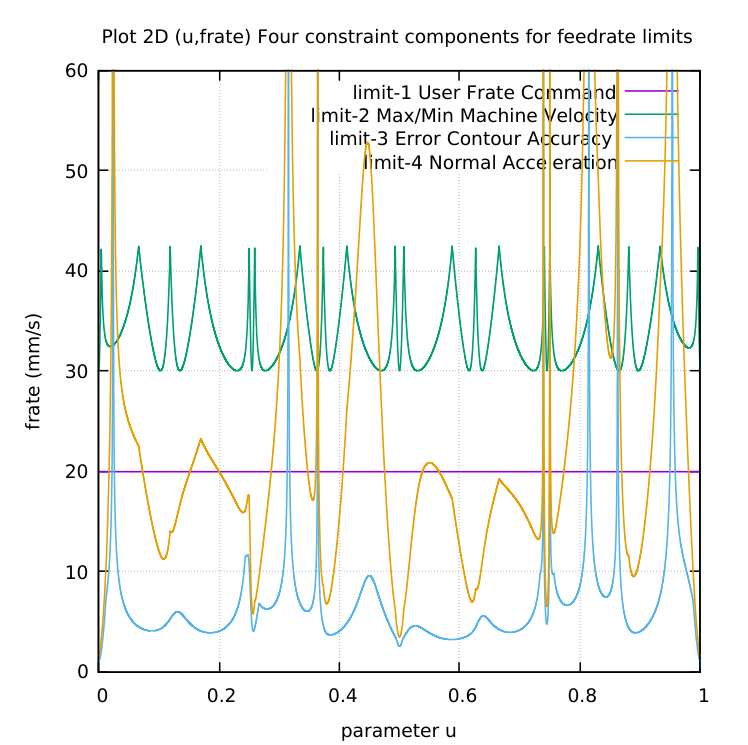
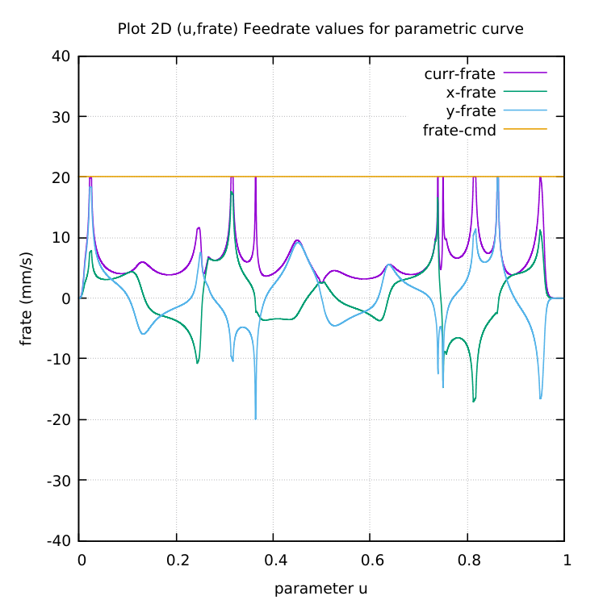

# BUTTERFLY-parametric-curve
BUTTERFLY parametric curve to GCode generation for CNC milling.

# The four(4) contributions to the Feedrate Limit

# Current feedrate = minimum of feedrate limits

Wassalam.
WRY
